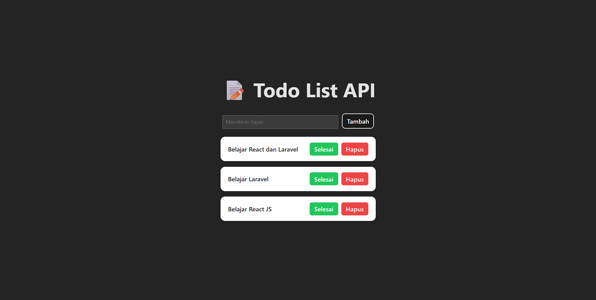

# 📝 Todo List App (React + Laravel API)

This project is a Fullstack Todo List Application built with:

- ⚛ React JS (Frontend)
- 🚀 Laravel REST API (Backend)
- 📦 MySQL Database

## 🎯 Features

- Add new todo
- View all todos
- Update todo status (completed / not completed)
- Delete todo
- Real-time UI update without page reload
- Full CRUD functionality

---

## 🛠 Tech Stack

Frontend:

- React JS (Vite)
- useState
- useEffect
- Fetch API

Backend:

- Laravel
- REST API
- API Resource
- Migration
- Controller

---

## 🚀 Installation (Frontend)

```bash
npm install
npm run dev
```

Runs on:

```
http://localhost:5173
```

---

## 🔌 Backend API

Backend must be running:

```bash
php artisan serve
```

Runs on:

```
http://127.0.0.1:8000
```

---

## 📸 Screenshots

Add your screenshots here:

```

```

---

## 👨‍💻 Author

Zaki Juniansyah  
GitHub: https://github.com/zakijuniansyah
